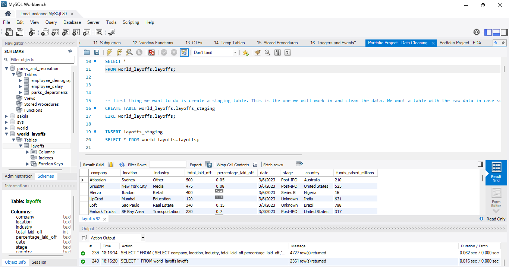
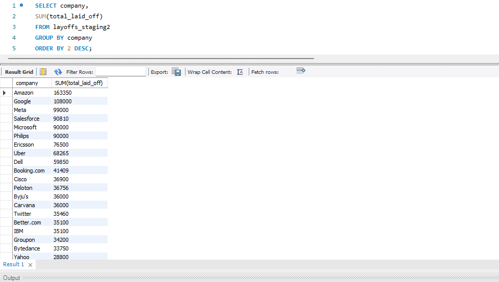
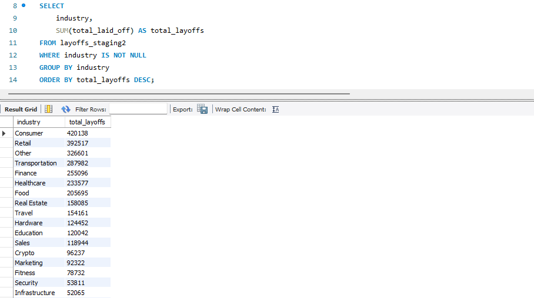
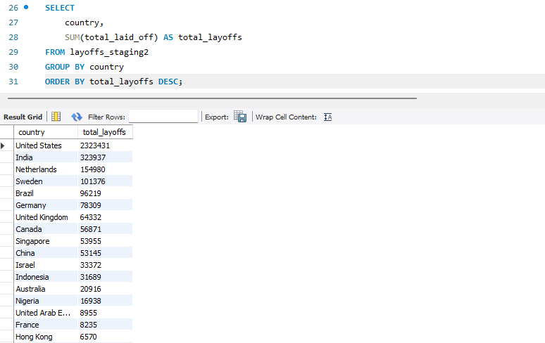
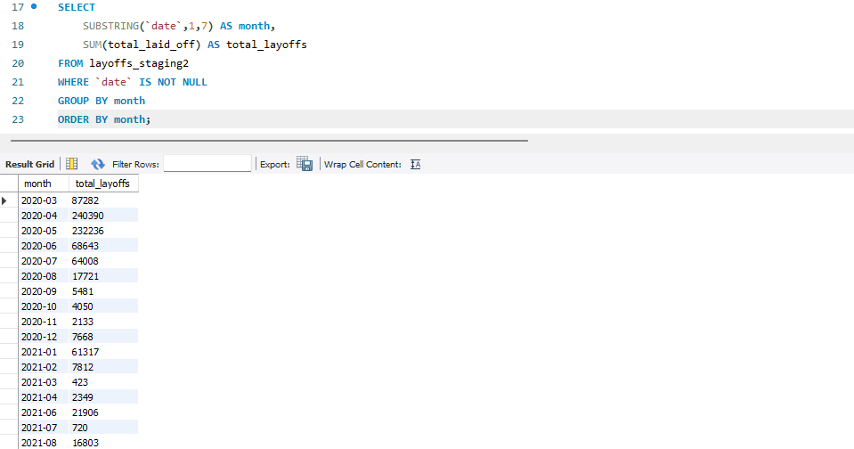

# MySQL Data Analysis Project

## Overview

This repository documents my hands-on learning and practical projects completed while studying MySQL for Data Analysis. It covers SQL concepts from beginner to advanced levels, followed by real-world applications in data cleaning and exploratory data analysis using a layoffs dataset.

---

## Skills Developed

Throughout these projects, I developed practical SQL skills commonly used in data analysis, including:

- Writing and optimizing SQL queries
- Retrieving and filtering data using `SELECT` and `WHERE`
- Sorting and aggregating data with `GROUP BY`, `ORDER BY`, and `HAVING`
- Combining tables using different types of `JOIN`s
- Applying string and date functions for data transformation
- Using `CASE` statements for conditional logic
- Working with Subqueries and Common Table Expressions (CTEs)
- Performing advanced analysis with Window Functions
- Creating Temporary Tables, Stored Procedures, and Triggers
- Cleaning, transforming, and preparing datasets for analysis
- Conducting Exploratory Data Analysis (EDA) to identify trends and insights

---

# Portfolio Projects

## Overview

---

## Top Companies by Layoffs

Analyzed companies with the highest number of employee layoffs.

---

## Industry Analysis

Examined layoff trends across different industries to identify the sectors most affected.

---

## Country Analysis

Compared layoffs across countries to identify geographical patterns and trends.

---

## Monthly Layoff Trends

Analyzed monthly layoff data to observe changes and trends over time.

---

## Technologies Used

- MySQL
- MySQL Workbench
